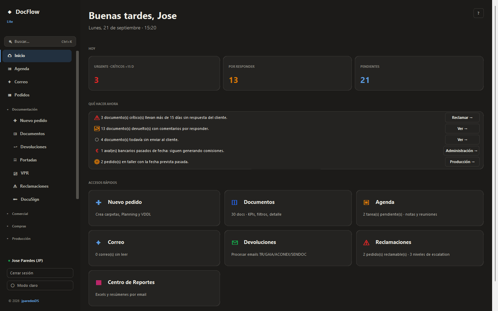
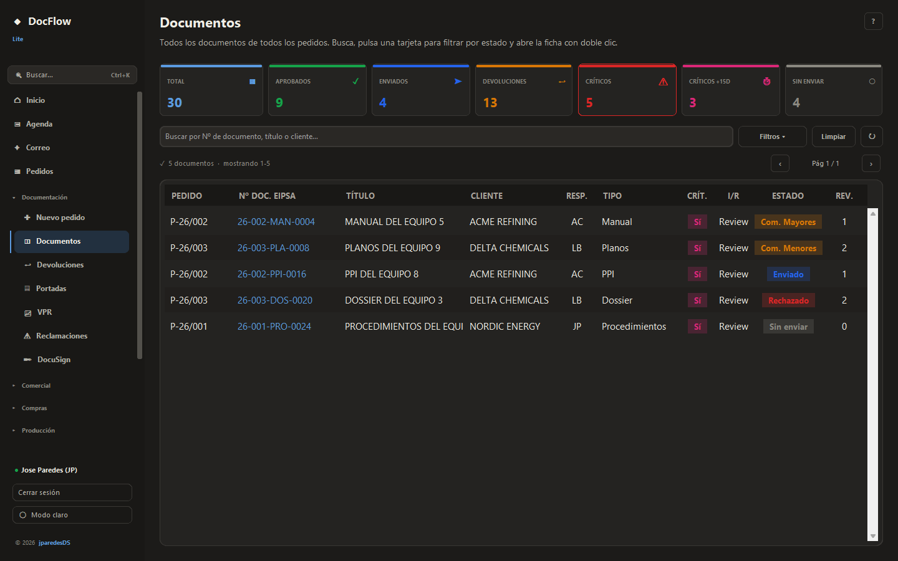
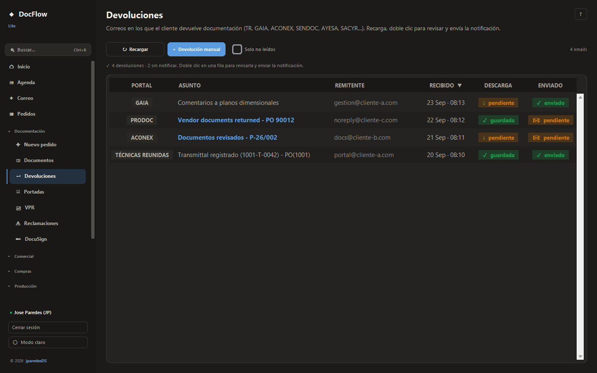
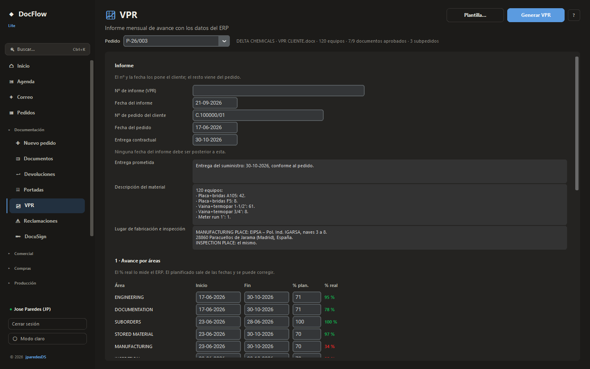

# DocFlow

**Edición Lite**: aplicación de escritorio para **Document Control** en proyectos de ingeniería: lleva la documentación de cada pedido de punta a punta — apertura, envíos al cliente, devoluciones de los portales, reclamaciones, portadas, informes de avance — leyendo los datos del ERP y dejando cada fichero en la carpeta de red que le toca.

Versión standalone (sin servidor) del sistema **DocFlow**, pensada para el día a día de una sola persona.

> Hecho con ❤️ por [jparedesDS](https://jparedesds.github.io/) · © 2026 · Todos los derechos reservados



---

## ✨ Qué hace

### 🏠 Inicio
Lo que hay que hacer hoy: críticos sin respuesta, devoluciones por contestar, documentos sin enviar, avales pasados de fecha y pedidos en taller con la fecha vencida. Cada aviso lleva a su sección.

### ▦ Pedidos
La ficha de un pedido de un vistazo: avance de documentación, fabricación, equipos y qué requiere acción.

### ◫ Documentos
Todos los documentos de todos los pedidos, con KPIs filtrables, búsqueda, paginación y ficha de detalle — incluido **quién lo ha tocado** (auditoría del ERP).



### ↩ Devoluciones
Los correos en los que el cliente devuelve documentación revisada. La app los interpreta, saca los documentos con su estado y manda el aviso al responsable.

Portales que entiende: **eGesDoc (Técnicas Reunidas), AYESA, SACYR (Proarc), PRODOC (Wood), Document Space (Hyundai), GAIA, ACONEX y SENDOC**.

Además, **descarga sola el paquete del portal** (cada 10 minutos) y lo reparte:

- el zip y el correo van a `00 TRANS Y RES\NNN (fecha)` del pedido;
- cada PDF devuelto, a su carpeta `dev. <Tipo>\rev<N> AP|COM|com|REJ`, respetando el estilo de numeración de ese pedido (correlativo, directo o por letras);
- **nunca se pisa un documento archivado**: si el destino está ocupado, se crea la carpeta siguiente o el fichero se guarda al lado.



### 🖹 Portadas
Rellena la plantilla de portada del cliente (Word o Excel) con los datos de cada documento. Los campos **se arrastran** a su hueco una sola vez por cliente y el emparejamiento queda guardado.

### 📈 VPR
El informe mensual de avance (*Vendor Progress Report*) con los datos del ERP: equipos agrupados por familia, documentos aprobados, subpedidos recibidos, fabricación e inspección. Lo medido se enseña calculado; lo que se promete al cliente —fechas, % planificado y los textos— llega escrito y se repasa antes de generar el Word.



### ⚠ Reclamaciones
Escalado en tres niveles (recordatorio · formal · urgente), con destinatarios guardados por pedido y envío masivo.

### ✚ Nuevo pedido
Crea la estructura de carpetas del pedido, su Planning (`.xlsm` con macros, intacto) y el índice de documentos a partir del catálogo.

### ✒ DocuSign · ✦ Correo · ▣ Agenda
Sobres de firma electrónica con su estado, lectura del buzón y tareas/notas/reuniones sincronizadas con los documentos pendientes.

### Departamentos
**Comercial** (ofertas), **Compras** (material pendiente de proveedor), **Producción** (taller y horas), **Calidad** (no conformidades y equipos de medida), **Administración** (facturas y avales) y **Almacén** (expediciones).

### 📊 Informes
Monitoring Report en Excel, informes web interactivos (semanal, mensual, ejecutivo y por pedido), resúmenes por correo y programación automática.

### 🎨 Detalles
Tema claro/oscuro persistente · paleta de comandos **Ctrl+K** · ayuda contextual con **F1** o el botón `?` de cada sección · avisos a Teams · subida a Nextcloud.

---

## 🚀 Instalación

### Requisitos
- **Python 3.12+** (desarrollado sobre 3.14, Windows)
- Acceso IMAP/SMTP para Devoluciones, Reclamaciones y Correo
- *(Opcional)* PostgreSQL del ERP en modo **solo lectura** — sin él la app funciona con los Excel de `data/`
- *(Opcional)* `ANTHROPIC_API_KEY` para los resúmenes con IA
- *(Opcional)* Microsoft Word y Excel instalados: se usan para convertir portadas e informes a PDF

### Pasos

```bash
git clone https://github.com/jparedesDS/docflow.git
cd docflow

python -m venv .venv
.\.venv\Scripts\Activate.ps1        # Windows
source .venv/bin/activate           # macOS/Linux

pip install -r requirements.txt

cp .env.example .env                # y rellena IMAP_PASS / SMTP_PASS
cp /ruta/a/data_erp.xlsx data/
cp /ruta/a/consulta_erp.xlsx data/

python app.py
```

Las contraseñas de los portales y del ERP **no se guardan en texto plano**: van al llavero de Windows (Credential Manager) o al almacén cifrado local, y se piden desde *Ajustes ▸ Portales*.

---

## ⌨️ Atajos

| Tecla | Qué hace |
|:-----:|:---------|
| `Ctrl+K` | Paleta de comandos: ir a cualquier sección o buscar un pedido |
| `F1` | Ayuda de la sección en la que estás |
| `Esc` | Cerrar el diálogo o volver |

---

## 📂 Estructura del proyecto

```
docflow/
├── app.py                          # Arranque: login, ventana y scheduler
├── core/
│   ├── config.py · preferences.py · auth.py · session.py
│   ├── parsers/                    # 8 parsers de correo (TR, AYESA, SACYR, PRODOC…)
│   ├── services/
│   │   ├── erp_db.py · erp_tags.py · erp_common.py     # ERP PostgreSQL (solo lectura)
│   │   ├── monitoring.py · audit.py                    # documentos y su trazabilidad
│   │   ├── transmittal.py · portal_downloads.py        # devoluciones y descarga
│   │   ├── egesdoc.py · ayesa.py · sacyr.py · prodoc.py · docspace.py
│   │   ├── dev_folders.py                              # archivado en carpetas dev.
│   │   ├── portadas.py · portadas_lote.py              # portadas del cliente
│   │   ├── plantilla_docx.py · plantilla_xlsx.py · formulario_docx.py
│   │   ├── vpr.py                                      # informe mensual de avance
│   │   ├── apertura.py · claims.py · docusign.py
│   │   ├── purchases.py · production.py · quality.py · administration.py · warehouse.py
│   │   ├── reports.py · analytics.py · scheduled_reports.py
│   │   ├── interactive_report/     # informe semanal, ejecutivo y de pedido
│   │   └── imap.py · smtp.py · nextcloud.py · teams.py
│   └── utils/                      # ficheros sin pisar nada, JSON con bloqueo, HTTP
├── gui/
│   ├── app.py                      # ventana, menú por departamentos y routing
│   ├── theme.py · help.py          # sistema de diseño y ayuda F1
│   ├── widgets/                    # sidebar, tablas, botones, toasts
│   └── views/                      # una por sección (21); las tres más grandes
│                                   # —pedidos, devoluciones y reportes— son paquetes
├── tests/                          # pruebas que se lanzan a mano, sin pytest
├── tools/capturas.py               # las capturas del README, con datos de mentira
├── docs/img/                       # capturas del README
├── data/                           # data_erp.xlsx, consulta_erp.xlsx
└── state/                          # JSON de runtime (preferencias, registros, logs)
```

---

## 🔧 Variables de entorno (`.env`)

```bash
# IMAP/SMTP — obligatorias para Devoluciones, Reclamaciones y Correo
IMAP_HOST=imap.tuservidor.com
IMAP_PORT=993
IMAP_USER=tu-email@dominio.com
IMAP_PASS=tu-password

SMTP_HOST=smtp.tuservidor.com
SMTP_PORT=465
SMTP_USER=tu-email@dominio.com
SMTP_PASS=tu-password

# Rutas locales (opcional — por defecto ./data/)
# DATA_ERP_PATH=...
# CONSULTA_ERP_PATH=...

# Carpeta base de pedidos en red (opcional): sin ella no se archiva en el pedido
# PEDIDOS_BASE_PATH=M:\base de datos de pedidos

# Claude API (opcional — resúmenes con IA)
# ANTHROPIC_API_KEY=sk-ant-...
```

---

## 🧪 Pruebas

No hay pytest: son guiones que se ejecutan a mano y terminan diciendo cuántos fallos hay.

```bash
.venv\Scripts\python.exe tests\import_all.py         # todos los módulos importan
.venv\Scripts\python.exe tests\smoke_views.py        # las 20 secciones se levantan
.venv\Scripts\python.exe tests\test_carpetas.py      # dónde cae cada documento devuelto
.venv\Scripts\python.exe tests\test_vpr.py           # el informe de avance
.venv\Scripts\python.exe tests\test_portadas.py      # plantillas Word y Excel
```

Los dos primeros son la red de seguridad rápida: `import_all` caza lo que el
linter no ve (un import circular, un nombre a medio renombrar) y `smoke_views`
construye cada sección en una ventana oculta, así que un widget con un
argumento inválido se cae ahí y no delante del usuario.

---

## 🧰 Stack técnico

- **GUI**: CustomTkinter 5 (Tkinter modernizado, sin Chromium ni .NET)
- **Datos**: PostgreSQL del ERP en solo lectura (psycopg2) + pandas · openpyxl · calamine
- **Correo**: imaplib + smtplib + tnefparse + striprtf
- **Portales**: requests + truststore (certificados del sistema)
- **Word/Excel**: edición del `.docx`/`.xlsx` como ZIP para no perder logos ni macros, y COM para el PDF
- **Scheduler**: APScheduler (BackgroundScheduler)
- **Credenciales**: keyring (Credential Manager) + almacén cifrado local
- **AI** *(opcional)*: anthropic (Claude)
- **Empaquetado**: PyInstaller (`build.spec`)

---

## 📚 Más información

- [Arquitectura](docs/ARQUITECTURA.md) — de dónde sale cada dato, cómo se reparten las capas y las reglas que no se saltan (no sobrescribir un documento, editar las plantillas como ZIP, el ERP en solo lectura).
- [Historia](CHANGELOG.md) — qué ha ido entrando y cuándo.

---

## 📜 Licencia

© 2026 [jparedesDS](https://jparedesds.github.io/). **Todos los derechos reservados.** Ver [LICENSE](LICENSE).

Este software es de uso personal. No se concede permiso para copiar, modificar, redistribuir ni explotar comercialmente sin autorización expresa del autor.

> Las capturas de pantalla usan datos de ejemplo: ni los pedidos, ni los clientes, ni los proveedores que aparecen son reales.

---

## 🔗 Enlaces

- 🌐 **Portfolio**: [jparedesds.github.io](https://jparedesds.github.io/)
- 💼 **GitHub**: [@jparedesDS](https://github.com/jparedesDS)
